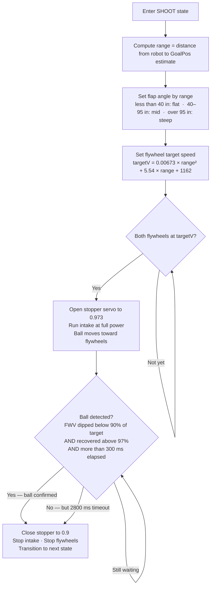

# DQP2025 Architecture & Design Document

**Team:** Decode Robotics  
**Season:** INTO THE DEEP (2024–25)  
**Last updated:** 2026-05-03

---

## 1. Overview

### What the robot does

Decode's robot competes in FTC's INTO THE DEEP season. The primary scoring mechanism is a **ball intake and flywheel launcher** that picks up game elements from the field floor and shoots them into a high goal. A **gate mechanism** physically pushes open a field gate obstacle to access additional intake zones. The robot uses a **mecanum drivetrain** for omnidirectional movement and a **webcam with AprilTag detection** for precise aiming at the goal.

### Match flow (end-to-end)

```
Power on
  └─ Android boots FtcRobotController Activity
       └─ Driver selects OpMode on Driver Station
            ├─ AUTONOMOUS (30 seconds)
            │    └─ Robot executes pre-programmed path:
            │         PRELOAD → SHOOT → INTAKE cycles → END
            │         (gate-open maneuver on cycle 1)
            └─ TELEOP (2 minutes)
                 └─ Driver controls drivetrain, intake, flywheels, turret
                      (AprilTag-assisted aiming via GoalPos tracker)
```

### Architecture layers

```
┌─────────────────────────────────────────────────────┐
│  Layer 6: Testing & Calibration                     │
│  FlywheelTesting, MonolithDetect                    │
├─────────────────────────────────────────────────────┤
│  Layer 5: TeleOp                                    │
│  BlueTeleopWebcam, RedTeleopWebcam                  │
├─────────────────────────────────────────────────────┤
│  Layer 4: Autonomous Framework                      │
│  BaseAuto + 5 gate-variant subclasses               │
├─────────────────────────────────────────────────────┤
│  Layer 3: Motion Library (Pedro Pathing)            │
│  Follower, Constants, PinpointLocalizer             │
├─────────────────────────────────────────────────────┤
│  Layer 2: Hardware Abstraction (Subsystems)         │
│  DecodeDriveTrain, GoalPos                          │
├─────────────────────────────────────────────────────┤
│  Layer 1: FTC SDK & Android Infrastructure          │
│  FtcRobotController Activity, OpMode registration   │
└─────────────────────────────────────────────────────┘
```

---

## 2. Layer 1 — FTC SDK & Android Infrastructure

### How the FTC app works

The robot controller runs as an **Android application** (`FtcRobotControllerActivity`) on the Control Hub or RC phone. On startup, the Activity connects to the Driver Station over Wi-Fi Direct and presents the available op-modes for the driver to select.

The activity hosts the FTC SDK runtime, which manages:
- Hardware device enumeration and mapping (motors, servos, sensors)
- Communication with the Driver Station
- Op-mode lifecycle management (`init()` → `init_loop()` → `start()` → `loop()` → `stop()`)

### Op-mode registration

All op-modes must be registered with the SDK. The `@TeleOp` and `@Autonomous` annotations (applied to any class that extends `OpMode` or `LinearOpMode`) do this automatically. The annotations specify:
- **name** — what appears on the Driver Station menu
- **group** — visual grouping on the menu

`FtcOpModeRegister.register(OpModeManager)` in the `internal` package is a callback *invoked by the SDK* at startup to collect registered op-modes. The team does not call this method — the SDK does.

### Key SDK files

| File | Role |
|------|------|
| `FtcRobotController/internal/FtcRobotControllerActivity.java` | Android Activity; app entry point |
| `FtcRobotController/internal/FtcOpModeRegister.java` | Op-mode registration hook |

> **For new members:** You will rarely touch these files. The SDK handles everything here. Your work lives in `TeamCode/`.

---

## 3. Layer 2 — Hardware Abstraction (Subsystems)

Location: `TeamCode/src/main/java/org/firstinspires/ftc/teamcode/subsystems/`

### Hardware map

All hardware devices are referenced by name strings that must match the configuration on the Control Hub. These string literals are currently scattered throughout the codebase:

| Device | String literal | Type |
|--------|----------------|------|
| Front-left motor | `"FL"` | DcMotorEx |
| Front-right motor | `"FR"` | DcMotorEx |
| Back-left motor | `"BL"` | DcMotorEx |
| Back-right motor | `"BR"` | DcMotorEx |
| Intake motor | `"intake"` | DcMotorEx |
| Flywheel 1 | `"FW1"` | DcMotorEx |
| Flywheel 2 | `"FW2"` | DcMotorEx |
| Turret motor | `"turret"` | DcMotorEx |
| Stopper servo | `"stopper"` | Servo |
| Flap servo | `"flap"` | Servo |
| GoBilda Pinpoint | `"pinpoint"` | GoBildaPinpointDriver |
| Webcam | `"Webcam 1"` | WebcamName |

> **Important:** If hardware names in the Control Hub configuration don't match these strings exactly, the robot will crash on init with a `NullPointerException` from `hardwareMap.get(...)`.

### `DecodeDriveTrain`

The drivetrain subsystem wraps the four mecanum motors. It is used directly by TeleOp op-modes for driver-controlled movement.

Key responsibilities:
- Motor direction configuration (FL reversed; BL, FR, BR forward — standard mecanum layout for this wiring)
- `Teleop(gamepad1)` — field-centric mecanum drive using the gamepad's left stick (translate) and right stick (rotate)
- `configurePinpoint()` — sets up the GoBilda Pinpoint odometry device (currently **commented out in TeleOp** — TeleOp does not use odometry for localization; only Auto does via Pedro Pathing)

> **Note for future members:** The `configurePinpoint()` call being commented out in TeleOp is intentional for the current season. Auto uses Pinpoint through Pedro Pathing's `PinpointLocalizer`. If you add odometry-assisted TeleOp in future, uncomment and integrate this.

### `GoalPos`

A 3D goal-position estimator used for flywheel aiming. It tracks where the scoring goal is in field coordinates relative to the robot.

How it works:
1. The webcam detects the alliance-specific AprilTag on the goal: **ID 20 for Blue, ID 24 for Red**. Any other tag is ignored.
2. `update(alpha, x, y, heading, elevation, dist)` converts the 3D polar measurement (distance + elevation angle) into field XY coordinates using a spherical-to-Cartesian projection, accounting for the camera's fixed 20° mount angle, then blends the result into a running estimate using an **exponential moving average** (α):
   - **First detection:** α = 1.0 — hard-sets the estimate to the measured position immediately.
   - **Subsequent detections:** α = 0.08 — small weight per frame, filtering out noisy measurements.
3. `findRange(x, y)` computes the Euclidean distance from the robot to the stored goal estimate — this drives flywheel speed.
4. `findAngle(x, y)` computes the bearing to the goal as `atan2(goalY - robotY, goalX - robotX)` — this drives the turret position.

Each `GoalPos` instance is seeded in the subclass via `createGoalPos()` with the known approximate field position of the alliance goal (e.g. Blue close: `(0, 144, 15.5)` inches). This means the turret has a reasonable target even before the first AprilTag detection.

**Turret angle → encoder ticks:** The turret motor operates in `RUN_TO_POSITION` mode. The conversion is **976 ticks per 180°**, so `targetTicks = degrees × 976 / 180`. Hardware limits are clamped per auto to protect the turret from over-rotation.

Both TeleOp and auto aiming (`cameraControls()` in `BaseAuto`) use `GoalPos`.

### Stopper and flap servos

These two servos work together to control the feeding and trajectory of each ball:

| Servo | Positions | Role |
|---|---|---|
| `stopper` | 0.9 = closed, 0.973 = open | **Gate** between the intake roller and the flywheels. Held closed during driving and ball collection so balls are stored inside the robot. Opened only when the flywheels are up to speed and the robot is ready to shoot. |
| `flap` | 0.0 / 0.2 / 0.24 | Adjusts the launch elevation angle at the flywheel exit. Set based on distance to goal: flat (close), mid, or steep (far). |

The stopper being closed during intake is what allows `moveIntake()` to run the intake motor freely without balls accidentally firing.

---

## 4. Layer 3 — Motion Library (Pedro Pathing)

Location: `TeamCode/src/main/java/org/firstinspires/ftc/teamcode/pedroPathing/`  
Library: `com.pedropathing:ftc:2.0.5`

### What Pedro Pathing is

Pedro Pathing is an FTC-specific path-following library. Unlike time-based or encoder-based movement, it uses **continuous odometry feedback** to follow smooth Bézier curves in real time. The robot's actual position is compared to its target position on the path every loop iteration, and correction forces are applied via a PIDF controller. This makes autonomous routines significantly more robust to wheel slip and disturbances.

### Why the team uses it

Pedro Pathing was adopted to replace the first-generation approach (hardcoded encoder distances with `144-x` coordinate mirroring). The key improvement is **field-relative coordinates**: paths are specified in inches from a fixed field origin, so `BlueClose` and `RedClose` can specify real positions without mirror-math workarounds.

### `Constants.java` — the configuration hub

All Pedro Pathing configuration is centralized here. Never hardcode robot dimensions or motor limits elsewhere.

| Constant group | What it configures |
|---|---|
| `driveConstants` | Motor names (FR/BR/BL/FL), measured max velocities (x: 85.3 in/s, y: 60.42 in/s) |
| `localizerConstants` | GoBilda Pinpoint swingarm pod offsets (-2.36, -0.94 inches from robot center) |
| `followerAutoConstants` | PIDF tuning for autonomous following |
| `followerTeleopConstants` | PIDF tuning for teleop following (different secondary gains) |
| `pathConstraints` | Max velocity: 0.99, max accel: 2.0, max angular velocity: 1.0, heading threshold: 0.3 |

Factory methods `createAutoFollower()` and `createTeleopFollower()` instantiate the `Follower` with the correct constants.

### GoBilda Pinpoint odometry

The robot uses a **GoBilda Pinpoint** dead-wheel odometry computer. Two swingarm pods (one forward, one strafe) measure wheel rotation directly. The Pinpoint fuses these into a pose estimate (x, y, heading) that Pedro Pathing's `PinpointLocalizer` reads each loop.

Pod offsets in `Constants.java`:
- Forward pod: -2.36 inches lateral from robot center
- Strafe pod: -0.94 inches forward from robot center

> **If odometry drifts:** First recalibrate the pod offsets by running the Pedro Pathing localization tuner (`Tuning` → Localization). Do not change `pathConstraints` until odometry is accurate.

### `Tuning` op-mode

`@TeleOp("Tuning", "Pedro Pathing")` — an interactive menu-driven op-mode (via the byLazar `fullpanels` dashboard) for tuning the follower. Provides sub-modes for:
- Localization testing
- Forward/lateral velocity tuning
- Drive PIDF tuning
- Automated and manual tuning sequences

Run this first when setting up the robot or after any drivetrain hardware change.

---

## 5. Layer 4 — Autonomous Framework

Location: `TeamCode/src/main/java/org/firstinspires/ftc/teamcode/Autos/`

### Overview

All current autonomous routines use a **template method pattern** implemented by `BaseAuto`. `BaseAuto` defines the lifecycle (init, loop) and calls abstract hook methods that each subclass implements to specify its unique paths and state machine.

```
BaseAuto (abstract OpMode)
├── BlueCloseGate     @Autonomous "Blue Close"       [ACTIVE]
├── BlueFarGate       @Autonomous "Blue Far Gate"    [ACTIVE]
├── RedClose15        @Autonomous "Red 15"           [ACTIVE]
├── RedCloseGate      @Autonomous "Red Close"        [ACTIVE]
└── RedFarGate        @Autonomous "Red Far Gate"     [ACTIVE]
```

### `BaseAuto` — what it provides

**Hardware initialized by `baseInit()`** (all subclasses call this):
- Drivetrain via Pedro Pathing `Follower` (`Constants.createAutoFollower()`)
- `intake` (DcMotorEx, direction REVERSE — no encoder mode set in `baseInit()`)
- `turret` (DcMotorEx, STOP_AND_RESET_ENCODER → RUN_TO_POSITION)
- `flyWheel1` (DcMotorEx, PIDF-controlled)
- `stopper` (Servo)
- `flap` (Servo)
- Webcam pipeline (VisionPortal + AprilTag processor)

> **Note on FW2:** `flyWheel2` (`"FW2"`) is **not** initialized by `BaseAuto`. Subclasses that use a second flywheel (`BlueCloseGate`, `RedClose15`, `RedCloseGate`) initialize it directly in their own `init()`. If you are adding a new auto and need FW2, initialize it in the subclass.

**`loop()` each frame:**
1. `follower.update()` — advances the robot along the current path
2. `statePathUpdate()` — checks if path is done, transitions state, issues motor commands
   - Inside `statePathUpdate()`, each subclass calls `aiming()` **on every iteration**, including during driving states. This means the turret is continuously tracking the goal throughout the entire match — it is already aimed by the time the robot arrives at any shoot position.
3. `cameraControls()` — one-time camera setup after 500 ms warmup (see camera guard above)

**Abstract methods subclasses must implement:**

| Method | Purpose |
|---|---|
| `getPIDFP()` | Returns the flywheel PIDF P gain (380 or 400 depending on tuning) |
| `createGoalPos()` | Returns the `GoalPos` instance for this alliance's target |
| `getStartPose()` | Returns the robot's starting `Pose` on the field |
| `getFWVConstant()` | Returns the flywheel target velocity (1025–1162 ticks/s, tuned per route) |
| `buildPaths()` | Constructs all `PathChain` objects for this auto |
| `statePathUpdate()` | The state machine — checks current state, transitions, issues motor commands |

**Camera initialization guard:**
`cameraControls()` is gated on both `opmodeTimer.milliseconds() > 500` **and** `!gainSet`. Because `gainSet` is set to `true` on first execution, `cameraControls()` runs **exactly once** — not every loop after 500 ms. This sets camera exposure and gain a single time after the pipeline has warmed up, preventing the `GoalPos` tracker from ingesting corrupted early measurements.

### State machine pattern

Each auto defines a `PathState` enum with values like `PRELOAD`, `SHOOTPRE`, `INTAKE1`, `OPENGATE`, `OUTTAKE1`, `SHOOT1`, `END`, `STOP`. `statePathUpdate()` is a `switch` over the current state:

```
case PRELOAD:
    if (!follower.isBusy()) {
        // path done — run intake, transition to SHOOTPRE
        setPathState(PathState.SHOOTPRE);
    }
    break;
```

`setPathState()` records the new state and calls `follower.followPath(nextPath)` to start the next movement.

### Two-segment intake pattern

Intake cycles 2 and 3 use **two path segments** per collection, not one. The first segment (`INTAKE21`) drives at full follower speed to the edge of the ball zone — no intake motor, no point sweeping empty space. The second segment (`INTAKE22`) uses `moveIntake()` which drives at reduced speed (37%) with the intake motor running, physically sweeping balls from the floor as the robot passes through the zone.

`moveIntake()` also takes a `timeoutMs` parameter — a minimum dwell after the path finishes before the state transitions:
- **50 ms** for close-side autos: the robot is already in position, just a debounce.
- **1500 ms** for far-side autos: extra dwell to allow balls rolling toward the intake to actually be collected.

The `holonomic` flag passed to `moveIntake()` controls Pedro Pathing's heading correction during the intake drive: `true` for close-side autos (normal mecanum), `false` for `RedCloseGate`/`RedClose15` where the intake path geometry requires non-holonomic correction.

### The five active autonomous routines

| Class | Alliance | Position | Cycles | Notes |
|---|---|---|---|---|
| `BlueCloseGate` | Blue | Close | 3 | Start `(14, 142, 139°)`, gate open on cycle 1 |
| `BlueFarGate` | Blue | Far | 2 | Start `(56, 0, 90°)`, ALIGNINTAKE rotation step |
| `RedClose15` | Red | Close | 3 | Most complex — includes BIGBACK retreat |
| `RedCloseGate` | Red | Close | 3 | Start `(120, 133, 0°)`, mirrors BlueCloseGate |
| `RedFarGate` | Red | Far | 2 | Start `(90, 0, 0°)`, mirrors BlueFarGate |

**Gate vs non-gate:** The `*Gate` suffix means the auto includes a gate-interaction maneuver. The close-side variants (`BlueCloseGate`, `RedCloseGate`, `RedClose15`) include an explicit `OPENGATE` path state that drives the robot into the gate obstacle to push it open. The far-side variants (`BlueFarGate`, `RedFarGate`) reach the gate as part of their intake approach path (`TOGATE` / `WAIT` states) rather than a dedicated push sub-routine. The older non-gate versions (`BlueClose`, `BlueFar`, `RedClose`, `RedFar`) are `@Disabled`.

**PIDF flywheel tuning per route:**

| Route | P gain | FWV (target velocity) | Reason |
|---|---|---|---|
| BlueCloseGate | 380 | 1162 | Standard close-side tune |
| BlueFarGate | 380 | 1025 | Reduced — was overshooting in testing |
| RedClose15 | 400 | 1150 | Higher P for tighter close control |
| RedCloseGate | 400 | 1162 | Standard close-side tune |
| RedFarGate | 380 | 1162 | Standard far-side tune |

---

## 6. Layer 5 — TeleOp

### Current state (important for new members)

The TeleOp situation is **in transition**:

| Class | Status | Notes |
|---|---|---|
| `BlueTeleopWebcam` | `@Disabled` | Working code — current competition-ready teleop for Blue |
| `RedTeleopWebcam` | `@Disabled` | Working code — current competition-ready teleop for Red |
| `OfficialBlueTeleop` | **Completely empty** | No class body, no annotations — does not appear on Driver Station |
| `OfficialRedTeleop` | **Completely empty** | No class body, no annotations — does not appear on Driver Station |

**The working teleop code is in `*TeleopWebcam`.** If you need to modify teleop behaviour, edit those files — not the `Official*` stubs.

### `BlueTeleopWebcam` / `RedTeleopWebcam`

These are full-featured TeleOp op-modes. They differ only in the `GoalPos` Y coordinate (Blue: `-50`, Red: `+50`) reflecting the goal's mirrored field position.

**Controls:**
- **Left stick:** Field-centric translation (via `DecodeDriveTrain.Teleop()`)
- **Right stick:** Rotation
- **Flywheel:** Both FW1 and FW2 run simultaneously via PIDF
- **Turret:** `RUN_TO_POSITION` motor, angle computed from `GoalPos.findAngle()`
- **Aiming:** `GoalPos.update()` called each loop with latest AprilTag detections
- **Stopper / flap:** Servo control for loading and launching game elements

---

## 7. Layer 6 — Testing & Calibration

Location: `TeamCode/src/main/java/org/firstinspires/ftc/teamcode/testcode/`

### `FlywheelTesting` — `@TeleOp "FW Testing"`

A standalone tuning op-mode for the flywheel and aiming system. Runs the drivetrain (for repositioning) and **FW1 only** (not FW2) with manual PIDF values (P=200, F=13.5). Initialises the webcam and `GoalPos` tracker so you can observe aiming behaviour in isolation without running a full auto or teleop.

Use this when:
- Tuning flywheel PIDF constants
- Testing camera-to-goal distance calculations
- Verifying `GoalPos` bearing and range outputs

### `MonolithDetect` — `@TeleOp "MonolithDetect"` (`@Disabled`)

Tests the Limelight3A pipeline that detects element ordering on the "monolith" (a field structure with three AprilTags, IDs 21/22/23). Maps tag detections to a Green/Purple element order vector. This is legacy test code from when the team was evaluating Limelight3A for vision. The production codebase uses the FTC SDK's built-in `AprilTagProcessor` instead.

---

## 8. Prior Generations (Legacy Code)

Understanding the legacy code helps new members avoid accidentally reintroducing old patterns. All legacy op-modes are `@Disabled` and should not be modified.

### Generation 1 — Direct OpMode extension (root package)

Files: `BlueSideClose`, `BlueSideFar`, `RedSideClose`, `RedSideFar` (root teamcode package)

These were written before the team adopted Pedro Pathing and the `BaseAuto` framework. Key characteristics that distinguish them from current code:

- Extend `OpMode` directly (not `BaseAuto`)
- Instantiate `DecodeDriveTrain` directly (no Pedro Pathing `Follower`)
- Use `(144 - x)` coordinate mirroring math — the Blue and Red versions share paths by flipping X around the field center. This works but is error-prone.
- Flywheel uses `RUN_USING_ENCODER` + `setVelocity()` but with no custom `PIDFCoefficients` — relies on the SDK's default velocity PID rather than the tuned coefficients used in current autos
- No webcam / `GoalPos` tracking

**Why superseded:** Pedro Pathing + Pinpoint odometry gives more consistent path following. `BaseAuto` reduces duplication between alliance variants. PIDF flywheel control replaced open-loop power.

### CenterStage era — `centerstageTeleOp`

An entirely different season's teleop (CenterStage, 2023–24). Uses:
- **Limelight3A** for vision (replaced by SDK AprilTag processor)
- Different hardware names: `FrontLeft`, `BackLeft`, `flopper`, `airplane`
- No Pedro Pathing, no Pinpoint odometry

This file exists only as historical reference. Do not revive any patterns from it.

### Older webcam autos — `BlueFar`, `BlueClose`, `RedFar`, `RedClose` (non-gate)

These are the immediate predecessors to the current Gate variants. They use `BaseAuto` and Pedro Pathing, but do not include the `OPENGATE` state. They were disabled once the gate maneuver was added.

> **BlueFar unique quirk:** Uses `Thread.sleep(3000)` for camera init rather than the `opmodeTimer.milliseconds() > 500` guard used everywhere else. This is the only file with this pattern — avoid copying it.

---

## 9. Build & Dependencies

### Module structure

```
DQP2025/
├── FtcRobotController/   ← FTC SDK Android app module (don't modify)
├── TeamCode/             ← All team code lives here
│   └── src/main/java/org/firstinspires/ftc/teamcode/
├── build.common.gradle   ← Android build config (compileSdk=34, signing)
└── build.dependencies.gradle ← All library dependencies
```

`TeamCode` declares a single module dependency:
```groovy
implementation project(':FtcRobotController')
```

### Key dependencies

| Library | Version | Purpose |
|---|---|---|
| FTC SDK (full suite) | 11.0.0 | Core robot framework, hardware drivers, vision |
| `com.pedropathing:ftc` | 2.0.5 | Autonomous path-following |
| `com.pedropathing:telemetry` | 1.0.0 | `SelectableOpMode` for Tuning menus |
| `com.bylazar:fullpanels` | 1.0.6 | Dashboard UI for `@Configurable` tuning panels |
| `androidx.appcompat:appcompat` | 1.2.0 | Android support |

### Adding a new dependency

Add to `build.dependencies.gradle` in the `dependencies {}` block. The byLazar repo (`https://mymaven.bylazar.com/releases`) is already declared as a repository — needed for `fullpanels`.

### Build variants

The project uses the standard FTC debug keystore at `libs/ftc.debug.keystore` for development builds. Production/competition signing is configured via environment variables (`SIGNING_KEY_ALIAS`, `SIGNING_KEY_PASSWORD`, `SIGNING_STORE_PASSWORD`).

---

## Appendix A: Structural Anomaly — `DecodeTeleop.java`

One file, `FtcRobotController/DecodeTeleop.java`, is placed at the root of the `FtcRobotController` module rather than in `TeamCode`. The knowledge graph detected this as its own isolated community (`ftcrobotcontroller-decodeteleop`) with only 2 nodes and the lowest cohesion score (0.0833) in the project.

This file almost certainly belongs at `TeamCode/src/main/java/org/firstinspires/ftc/teamcode/DecodeTeleop.java`. Moving it would consolidate all team code in one module and eliminate the anomaly. It is currently not annotated as active (`@TeleOp`/`@Autonomous`), so moving it carries no runtime risk.

---

## Appendix B: Planned Refactor

Full spec: [`docs/superpowers/specs/2026-05-03-java-refactor-design.md`](superpowers/specs/2026-05-03-java-refactor-design.md)

### Phase 1 — Constants extraction

New files to create:

| New file | What it centralises |
|---|---|
| `config/HardwareNames.java` | All `hardwareMap.get(...)` name strings |
| `config/RobotConstants.java` | Magic numbers: PIDF gains, servo positions, timeouts, AprilTag IDs, FWV formula coefficients |

Representative before → after:

| Before (scattered literal) | After (constant) | File(s) affected |
|---|---|---|
| `"FL"`, `"FR"`, `"BL"`, `"BR"` | `HardwareNames.FRONT_LEFT` etc. | BaseAuto, DecodeDriveTrain, Constants.java, all autos |
| `"FW1"`, `"FW2"` | `HardwareNames.FLYWHEEL_1/2` | BaseAuto, BlueCloseGate, RedClose15, RedCloseGate |
| `"FW"` | `HardwareNames.FLYWHEEL_LEGACY` | Gen-1 legacy autos |
| `"intake"`, `"turret"`, `"stopper"`, `"flap"` | `HardwareNames.*` | BaseAuto, TeleOp files |
| `"Webcam 1"`, `"pinpoint"` | `HardwareNames.WEBCAM/PINPOINT` | BaseAuto, FlywheelTesting |
| `0.9` (stopper closed) | `RobotConstants.STOPPER_CLOSED` | BaseAuto, BlueCloseGate, RedClose15, RedCloseGate, TeleOps |
| `0.973` (stopper open) | `RobotConstants.STOPPER_OPEN` | same |
| `976` (turret ticks/180°) | `RobotConstants.TURRET_TICKS_PER_180_DEG` | all autos |
| `1600` (shoot timeout, RedClose15) | `RobotConstants.SHOOT_TIMEOUT_FAST_MS` | RedClose15 only |
| `2800` (shoot timeout, others) | `RobotConstants.SHOOT_TIMEOUT_MS` | BlueCloseGate, RedCloseGate |
| `detection.id == 20` | `RobotConstants.APRILTAG_ID_BLUE` | Blue autos |
| `detection.id == 24` | `RobotConstants.APRILTAG_ID_RED` | Red autos, FlywheelTesting |

---

### Phase 2 — Naming cleanup

**Method renames:**

| Before | After | Class | Callsites |
|---|---|---|---|
| `Teleop(gamepad1)` | `drive(gamepad1)` | `DecodeDriveTrain` | `BlueTeleopWebcam`, `RedTeleopWebcam`, `centerstageTeleOp`, `DecodeTeleop` |
| `baseInit()` | `initHardware()` | `BaseAuto` | all 5 active autos + 4 disabled non-gate autos |
| `findAngle(x, y)` | `findBearing(x, y)` | `GoalPos` | all 5 active autos, `BlueTeleopWebcam`, `RedTeleopWebcam`, `FlywheelTesting` |

**Field renames:**

| Before | After | Class |
|---|---|---|
| `a, b, c` | `goalX, goalY, goalZ` | `GoalPos` |
| `camAngle` | `camElevationAngleDeg` | `GoalPos` |
| `p, d, i, f` | `pidP, pidD, pidI, pidF` | `BaseAuto`, `BlueTeleopWebcam`, `RedTeleopWebcam`, `FlywheelTesting` |
| `FL, FR, BL, BR` | `frontLeft, frontRight, backLeft, backRight` | `DecodeDriveTrain` |
| `FWTarget` | `flywheelTarget` | `BaseAuto` |
| `FW1Target` | `flywheelTarget` | `FlywheelTesting` |
| `FWV1, FWV2` | `flywheelVelocity1, flywheelVelocity2` | `BlueTeleopWebcam`, `RedTeleopWebcam` |
| `PowerFL/FR/BL/BR` (locals) | `powerFl/Fr/Bl/Br` | `DecodeDriveTrain` |

**Path variable renames (PascalCase → camelCase, per auto):**

| Before | After |
|---|---|
| `Preload` | `preload` |
| `Opengate` / `Togate` | `openGate` / `toGate` |
| `BigBack` | `bigBack` |
| `OuttakeB` | `outtakeB` |
| `AlignIntake` | `alignIntake` |
| `End` | `end` |
| *(all other path vars)* | *(matching camelCase)* |

---

### Phase 3 — Package and class reorganisation

**Class renames:**

| Before | After | Notes |
|---|---|---|
| `DecodeDriveTrain` | `MecanumDrive` | reflects actual mechanism |
| `GoalPos` | `TargetTracker` | reflects role (tracker, not a position type) |
| `BlueTeleopWebcam` | `BlueTeleop` | remove hardware detail from class name |
| `RedTeleopWebcam` | `RedTeleop` | same |
| `pedroPathing/Constants` | `FollowerConfig` | avoids conflict with Java's `Constants` convention |
| `centerstageTeleOp` | `CenterStageTeleOp` | fix PascalCase |
| `RedClose15` | `RedCloseExtended` | *pending team confirmation of what "15" means* |

**Package renames:**

| Before | After |
|---|---|
| `Autos/` | `autos/` |
| `TeleOp/` | `teleop/` |

**File moves:**

| File | From | To |
|---|---|---|
| `BlueTeleopWebcam` | `TeleOp/` | `teleop/` |
| `RedTeleopWebcam` | `TeleOp/` | `teleop/` |
| `TestAuto` | `Autos/` | `testcode/` |
| `centerstageTeleOp` | root teamcode | `testcode/` |
| `DecodeTeleop.java` | `FtcRobotController/` | `TeamCode/.../teamcode/` |

**Deletions:**

| File | Reason |
|---|---|
| `OfficialBlueTeleop.java` | Completely empty — no class body |
| `OfficialRedTeleop.java` | Completely empty — no class body |

---

## Appendix C: Autonomous Mode — Student Reference

This appendix gives two views of the same 30-second autonomous run, using **BlueCloseGate** as the concrete example. Read these alongside §5 to understand *why* the state machine is structured the way it is.

> **The single most important thing to understand:** `aiming()` runs on **every loop iteration** — including while the robot is driving. The turret continuously tracks the goal throughout the entire match. By the time the robot arrives at any shoot position, the turret is already aimed and the `GoalPos` estimate has had the entire drive to converge.

---

### What each subsystem does per state

| State | Robot movement | Vision & turret | Intake roller | Flywheels | Stopper servo |
|---|---|---|---|---|---|
| **PRELOAD** | Fast drive: start → shoot zone (40, 105) | Tracking | Off | Off | Closed (0.9) |
| **SHOOTPRE** | Stationary — hold position | Converging on estimate | Off | **Spinning up** to target velocity | Closed → **opens (0.973)** when up to speed |
| **INTAKE1** | **Slow (37%)** drive through ball zone → (11, 99) | Tracking | **On** — sweeps balls from floor | Off | Closed — holds collected balls inside |
| **OPENGATE** | Drive Bézier curve into gate → (4.5, 93) | Tracking | Off | Off | Closed |
| **OUTTAKE1** | Fast drive back to shoot zone (38, 105) | Tracking — estimate refining | Off | Off | Closed |
| **SHOOT1** | Stationary | Locked on | **On** — feeds ball into flywheels | **Spins up → fires → off** | **Opens** → ball passes → **closes** |
| **INTAKE21** | Fast approach to ball zone edge (38, 77) | Tracking | Off | Off | Closed |
| **INTAKE22** | **Slow (37%)** sweep through ball zone → (10, 75) | Tracking | **On** — sweeps balls | Off | Closed |
| **OUTTAKE2** | Fast drive back to shoot zone | Tracking — refining | Off | Off | Closed |
| **SHOOT2** | Stationary | Locked on | **On** — feeds ball | **Spins up → fires → off** | **Opens → closes** |
| **INTAKE31/32** | Same pattern as INTAKE21/22, next zone → (10, 54) | Tracking | **On** during slow segment | Off | Closed |
| **OUTTAKE3** | Fast drive back | Tracking | Off | Off | Closed |
| **SHOOT3** | Stationary | Locked on | **On** — feeds ball | **Spins up → fires → off** | **Opens → closes** |
| **END** | Drive to park position (25, 87) | Off — aiming stops at 29.3 s | Off | Off | Closed |

---

### State machine overview

One preload shot, then three collect → return → shoot cycles.

```mermaid
flowchart TD
    START([Match start]) --> PRELOAD

    subgraph FIRST["Preload ball"]
        PRELOAD["PRELOAD<br/>Fast drive to shoot zone<br/>Turret begins tracking"]
        --> SHOOTPRE["SHOOTPRE<br/>Hold position · Camera warms up<br/>Flywheels spin up · Ball fires"]
    end

    SHOOTPRE -->|ball confirmed fired| INTAKE1

    subgraph C1["Cycle 1 — includes gate opening"]
        INTAKE1["INTAKE1<br/>Slow drive · Intake ON · Collect ball"]
        --> OPENGATE["OPENGATE<br/>Drive Bézier into gate<br/>Robot body pushes gate open physically"]
        --> OUTTAKE1["OUTTAKE1<br/>Fast drive back · Turret tracking whole way"]
        --> SHOOT1["SHOOT1<br/>Spin up · Stopper opens · Ball fires"]
    end

    SHOOT1 -->|ball confirmed fired| INTAKE21

    subgraph C2["Cycle 2"]
        INTAKE21["INTAKE21<br/>Fast approach to ball zone"]
        --> INTAKE22["INTAKE22<br/>Slow drive · Intake ON · Collect ball"]
        --> OUTTAKE2["OUTTAKE2<br/>Fast drive back · Turret tracking"]
        --> SHOOT2["SHOOT2<br/>Spin up · Stopper opens · Ball fires"]
    end

    SHOOT2 -->|ball confirmed fired| INTAKE31

    subgraph C3["Cycle 3  (identical pattern to cycle 2)"]
        INTAKE31["INTAKE31<br/>Fast approach"]
        --> INTAKE32["INTAKE32<br/>Slow drive · Intake ON · Collect ball"]
        --> OUTTAKE3["OUTTAKE3<br/>Fast drive back · Turret tracking"]
        --> SHOOT3["SHOOT3<br/>Spin up · Stopper opens · Ball fires"]
    end

    SHOOT3 -->|ball confirmed fired| ENDMOVE["END<br/>Drive to park position (25, 87)"]
    ENDMOVE --> STOP([Match over — 30 s])
```



---

### How a single shot works

All SHOOT states run the same sequence.



> **Why the FWV dip?** When the ball hits the spinning flywheel wheels it briefly slows them down. The code detects this velocity dip to confirm the ball has actually passed through — without it, the robot would not know whether the shot succeeded and could get stuck waiting for the full 2800 ms timeout every cycle.

---

### Quick-reference: hardware states

| Component | During movement / intake | During a shot |
|---|---|---|
| Stopper servo | 0.9 — closed, balls held inside robot | 0.973 — open, ball feeds into flywheels |
| Flap servo | 0.2 (initialised) | 0 / 0.2 / 0.24 — set by range at shot time |
| Intake motor | Off between zones · On (power 1) during slow intake paths | On (power 1) to feed ball into flywheels |
| FW1 / FW2 | Off | `RUN_USING_ENCODER` at `targetV` ticks/s |
| Turret motor | `RUN_TO_POSITION` — continuously tracking goal | Same — keeps tracking while firing |
